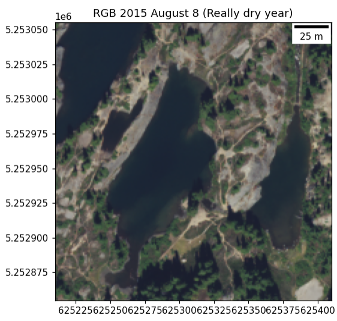

# Backcountry-Alpine-Visitor-Use

### Introduction

The population of the Western US has gorwn markedly in the last 10 years, especially in Western Washington. This growth has translated into increased reacreation within the National Forests and the three National Parks found within Washington's borders. As use increases, documentation of the degredation of these wilderness areas has increased, but the possible contribution of remote sensing using satellinte imagery and LIDAR have yet to be explored. Social trails, common in alpine areas, have long been used by visitors to connect and create campsites as well as navigate topology. It is posited, as visitation rates grow, social trail use will also intensify, compacting alpine soils, killing plants and expanding the breadth of previously established trail networks. This project will evaluate the feasibility of using the National Agriculture Imagery Program (NAIP) and the social trails in alpine wilderness areas in Washington State. If plausible, polygons will be used to capture social trail expanse and track it over time.

### Team Members

* Gabriel Wisswaesser

### Examples of Imagery to Be Ivestigated

### Rampart Lakes RBG

 

### Rampart Lakes Red/Blue

### Product

* A notebook with investigator steps into feasability of using rasters to measure social trails

### Python Packages
* imageio
* matplotlib
* numpy
* os
* Rasterio
* urllib

# Conclusions

* Red band was the best
    * normalization added rocks (high sensitivity, low selectivity)
    * r/b ratio removed rocks, but lost other sections of social trails and added others (mid sensitivity, low selectivity)
    * 
* Compare between years
    * Hard to compare between years
      * precip differences
      * photos taken at different times of day
      * vegetation casts shadows

* Might be useful under different expectations and conditions
    * True alpine or open space with no tall vegetation
    * Photos were same day and time of each year
    * use imagery to determine impervious to semi-impervious surfaces instead of only social trails
        * This would combine rocks and open soils (compacted from trails included). Possible difference in area between years could be increasing social trails as rocks likely to                                    remain the same

### Data Source

*https://earthexplorer.usgs.gov/
