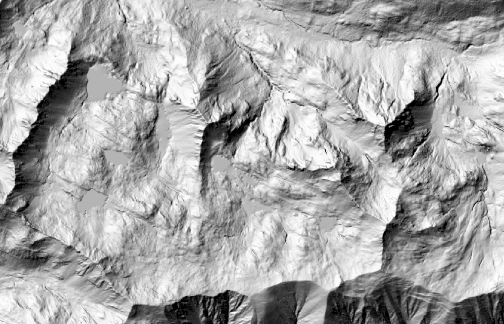

# Backcountry-Alpine-Visitor-Use

### Introduction

The population of the Western US has gorwn markedly in the last 10 years, especially in Western Washington. This growth has translated into increased reacreation within the National Forests and the three NAtional Parks found within Washington's borders. As use increases, documentation of the degredation of these wilderness areas has increased, but the possible contribution of remote sensing using satellinte imagery and LIDAR have yet to be explored. Social trails, common in alpine areas, have long been used by visitors to connect and create campsites as well as navigate topology. It is posited, as visitation rates grow, social trail use will also intensify, compacting alpine soils, killing plants and expanding the breadth of previously established trail networks. This project will evaluate the feasibility of using the National Agriculture Imagery Program (NAIP) and the Washinton Lidar Portal to capture social trails in alpine wilderness areas in Washington State. If plausible, polygons will be used to capture social trail expanse and track it over time.

### Team Members

* Gabriel Wisswaesser

### Example of Imagery to Be Ivestigated

LIDAR image of Seven Lakes Basin



<br>

Satellite image of social trail at Seven Lakes Basin


### Software dependencies

To be determined

#### Python Packages

To be determined

### Directory Summary

To be determined

### Directory Structure


```
project
    ├── License
    ├── README.md
    ├──lidar.png
    ├──satellite.png
```

### Data Source

To be determined
